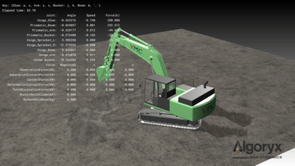

[](https://opensource.org/licenses/Apache-2.0)

# cet200

VMT-CET200：**C**onstruction **E**xcavator, **T**racked（履带式工程挖掘机）
面向 [AGX Dynamics](https://www.algoryx.se/agx-dynamics) 物理引擎的虚构 20 吨级液压挖掘机模型。

包含 Xacro／URDF 文件、STEP 格式 CAD 文件、GLB（glTF）格式 3D 模型文件，因此除 AGX Dynamics 之外也可用于其他用途。



## 仓库结构

```shell
cet200
|-cet200_agxpy_standalone  # AGX Python 示例程序
|-cet200_description       # URDF 模型
|-agx_file                 # AGX 文件
|-openplx                  # （开发中）OpenPLX 文件
|-spaceclaim_momentum      # SpaceClaim + Algoryx Momentum 文件
|-exchange_formats         # 通用模型文件（glb、step）
|-tools                    # 模型转换等工具
|-docs                     # 规格表等文档
```

## 运行要求

### [cet200_agxpy_standalone](#cet200_agxpy_standalone) 要求

- 操作系统：Windows、Ubuntu
- AGX Dynamics >= 2.40.1.5
    - 授权模块：Core、Tracks、Terrain、Granular
    - 参考：[VMT Developer Portal（外部站点）](https://developer.vmc-motion.com)
    - [咨询与试用授权申请（外部站点）](https://www.vmc-motion.com/%E3%81%8A%E5%95%8F%E3%81%84%E5%90%88%E3%82%8F%E3%81%9B/)
- Python：AGX Dynamics 所支持的 Python 版本
- 可选：XInput 方式的手柄

### [cet200_description](#cet200_description) 要求

- 操作系统：Ubuntu（Windows 未验证）
- ROS2

### spaceclaim_momentum 要求

- 操作系统：Windows（不支持 Ubuntu）
- Ansys SpaceClaim >= 2024 R2
- Algoryx Momentum >= 2.8.1

## 已验证环境

- Windows 11、Python 3.9.9、AGX-2.40.1.5
- Ubuntu 22.04、ROS2 Humble、Python 3.10.12、AGX-2.41.1.0

## 下载

仓库中包含多个 3D 模型。
可完整克隆，也可只检出需要的模型。

- 完整克隆：`git clone <REPO>`
- [部分检出](docs/git_sparse_checkout.md)

## cet200_agxpy_standalone

使用 AGX Dynamics Python API 编写、可单独以 Python 运行的示例程序包。

### 用 python 命令运行示例程序

```shell
# Windows 示例
# 请在已设置 AGX 环境变量的命令行中执行

# 安装
git clone <REPO>
cd cet200

# 【推荐】创建并启用虚拟环境
python -m venv .venv
.venv\Scripts\activate

# 以 editable 方式安装 cet200_agxpy_standalone 包
cd cet200_agxpy_standalone
python -m pip install -r requirements.txt
python -m pip show cet200_agxpy_standalone

# 运行程序
cd src/cet200_agxpy_standalone/apps
python cet200_on_terrain.py
```

### 用 ros2 run 命令运行示例程序

```shell
# 请在已设置 AGX 环境变量的 shell 中执行

# 安装
mkdir -p ~/ros_ws/src
cd ~/ros_ws/src
git clone <REPO>

# 安装依赖包
cd ~/ros_ws
rosdep install --from-paths src --ignore-src -r -y

# 构建与安装
colcon build --symlink-install
source ~/ros2_ws/install/setup.bash
# 确认安装结果
ros2 pkg executables cet200_agxpy_standalone

# 运行程序
ros2 run cet200_agxpy_standalone cet200_on_terrain
```

### 操作方法

```shell
# 手柄（XInput 方式）
前进：LB、RB
后退：LT、RT
回转：左摇杆 左右
斗杆升降：左摇杆 上下
铲斗挖掘、卸料：右摇杆 左右
动臂升降：右摇杆 上下

# 键盘
行走：方向键
回转：a、s
斗杆升降：z、x
动臂升降：m、,
铲斗挖掘、卸料：j、k
```

## cet200_description

Xacro/URDF 模型。

### 用 RViz 可视化

参照 cet200_agxpy_standalone 完成 colcon build 后，执行以下命令。

```shell
ros2 launch cet200_description display.launch.py
```

## 其他

- [程序引用的模型文件](docs/program_dependent_model_files.md)
- [3D 模型转换流程](docs/3d_modeling_pipeline.md)

## 联系方式

support@vmc-motion.com

## 许可证

Copyright 2026 VMC Motion Technologies Co., Ltd.
基于 Apache-2.0 许可证授权。
详见 [LICENSE](LICENSE) 与 [NOTICE](NOTICE)。
